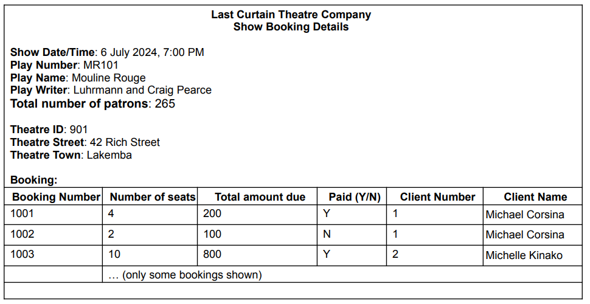

# Task 3: Normalisation (15 marks)

## 任务分析

Below is an example of booking details for a particular Last Curtain Theatre Company’s show.

Last Curtain Theatre Company 某场演出的预订详情示例.

信息包括：

- **演出日期/时间**: 2024年7月6日，晚上7点
- **剧目编号**: MR101
- **剧目名称**: Mouline Rouge
- **剧作家**: Luhrmann 和 Craig Pearce
- **总观众人数**: 265人

剧院信息：

- **剧院ID**: 901
- **剧院地址**: 42 Rich Street, Lakemba

预订信息：

- **预订编号 1001**: 4个座位，总费用200，已支付，客户编号1，客户姓名Michael Corsina
- **预订编号 1002**: 2个座位，总费用100，未支付，客户编号1，客户姓名Michael Corsina
- **预订编号 1003**: 10个座位，总费用800，已支付，客户编号2，客户姓名Michelle Kinako

将这个表单表示成“第三范式”（UNF，Unnormalized Form）。在创建你的representation时，你应该考虑在任务2中给出的“Last Curtain Theatre Company”案例研究。你必须将每个人的名字保持为一个简单的属性。

keep each person's name as a simple attribute.

继续将数据规范化到第三范式（3NF）。在每个步骤中清晰地写出从非规范化形式（UNF）到第三范式（3NF）的关系。请从第一范式（1NF）开始，明确标出所有关系的主键，通过下划线表示主键属性，并通过依赖图展示依赖关系（在1NF阶段的部分依赖关系，在2NF阶段的传递依赖关系，以及在3NF阶段的完全依赖关系），例如：a_id → a_name, a_desc。同时在1NF阶段包括所有候选键。

## 任务描述：

描述：
- 将数据逐步规范化，最终达到第三范式(3NF);
- 每个步骤中，要明确写出数据库关系。

步骤要求：
- 从非规范化形式(UNF)开始；
- 在每个范式阶段(1NF,2NF,3NF)都要展示关系；
- 在1NF阶段以及以后，需要通过下划线标出每个关系的主键。
- 展示依赖关系：
  - 1NF阶段：部分依赖关系；
  - 2NF阶段：传递依赖关系；
  - 3NF阶段：完全依赖关系。

依赖关系图示例：
- a_id → a_name, a_desc

候选键：
- 在1NF阶段需要列出所有的候选键。
